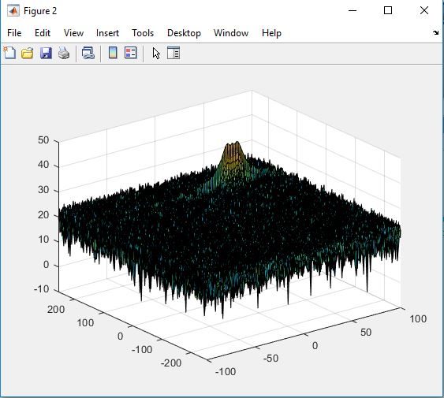
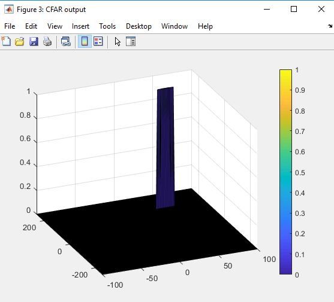

# Radar Target Generation and Detection

The purpose of this project is to implement the following radar processing loop: 


#### 2D CFAR


The following parameters are used for my implementation :

```sh
#The number of Training Cells in both the dimensions.
Tr = 10
Td = 5
# the number of Guard Cells in both dimensions around the Cell under test (CUT) for accurate estimation
Gr = 10
Gd = 5
# offset the threshold by SNR value in dB
Offset = 10
```

Which provides a grid size of 861 and a number training cells of 630. 

##### 2D CFAR Implementation steps
- Slide the cell under test across the complete matrix. Make sure the Cell under test (CUT) has margin for Training and Guard cells from the edges.
- For every iteration sum the signal level within all the training cells. To sum convert the value from logarithmic to linear using db2pow function.
- Average the summed values for all of the training cells used. After averaging convert it back to logarithmic using pow2db.
- Further add the offset to it to determine the threshold.
- Next, compare the signal under CUT against this threshold.
- If the CUT level > threshold assign it a value of 1, else equate it to 0.

The process above will generate a thresholded block, which is smaller than the Range Doppler Map as the CUTs cannot be located at the edges of the matrix due to the presence of Target and Guard cells. Hence, those cells will not be thresholded.

- To keep the map size same as it was before CFAR, equate all the non-thresholded cells to 0.

##### MATLAB Code 

    
The following code is the implementation of the above steps :
```
%% CFAR implementation

%Slide Window through the complete Range Doppler Map

% *%TODO* :
%Select the number of Training Cells in both the dimensions.
Tr = 10;
Td = 5;

% *%TODO* :
%Select the number of Guard Cells in both dimensions around the Cell under 
%test (CUT) for accurate estimation
Gr = 10;
Gd = 5;
Gsize = (2*Tr+2*Gr+1)*(2*Td+2*Gd+1);
Ncells =  (2*Tr+2*Gr+1)*(2*Td+2*Gd+1) - (2*Gr+1)*(2*Gd+1);
% *%TODO* :
% offset the threshold by SNR value in dB
offset = 10;

% *%TODO* :
%Create a vector to store noise_level for each iteration on training cells
noise_level = zeros(Nr/2-2*(Td+Gd),Nd-2*(Tr+Gr));


% *%TODO* :
%design a loop such that it slides the CUT across range doppler map by
%giving margins at the edges for Training and Guard Cells.
%For every iteration sum the signal level within all the training
%cells. To sum convert the value from logarithmic to linear using db2pow
%function. Average the summed values for all of the training
%cells used. After averaging convert it back to logarithimic using pow2db.
%Further add the offset to it to determine the threshold. Next, compare the
%signal under CUT with this threshold. If the CUT level > threshold assign
%it a value of 1, else equate it to 0.
signal_cfar = zeros(size(RDM));
threshold_cfar = zeros(size(RDM));
RDM_db = db2pow(RDM);


   % Use RDM[x,y] as the matrix from the output of 2D FFT for implementing
   % CFAR
for i = Tr+Gr+1:Nr/2-(Gr+Tr)
    for j = Td+Gd+1:Nd-(Gd+Td)
         noise = 0;
         for n = i-(Tr+Gr):i+(Tr+Gr)
            for m = j-(Td+Gd):j+(Td+Gd)              
                if (abs(i-n)>Gr || abs(j-m)>Gd)
                    noise = noise +RDM_db(n,m);
                end
            end
         end
    
    threshold = pow2db(noise/Ncells);
    threshold = threshold + offset;
        if(RDM(i,j) > threshold)
            signal_cfar(i,j) = 1;
        end

   end
end
```

##### Output 
The following figure is the generated target : 

Which gives the following output after CFAR processing : 

